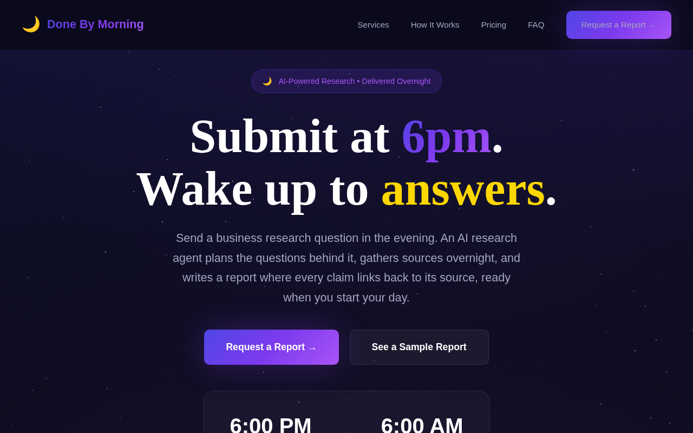
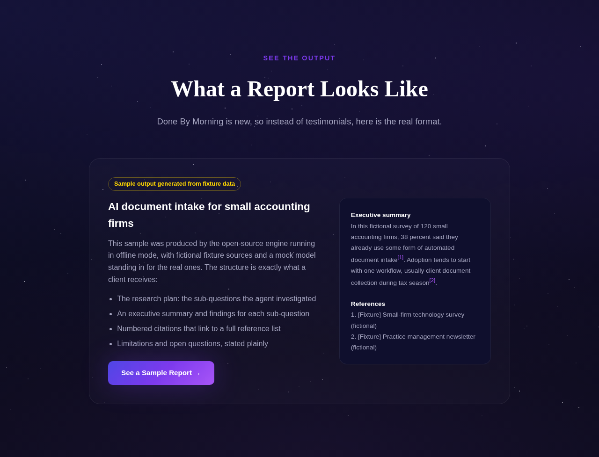
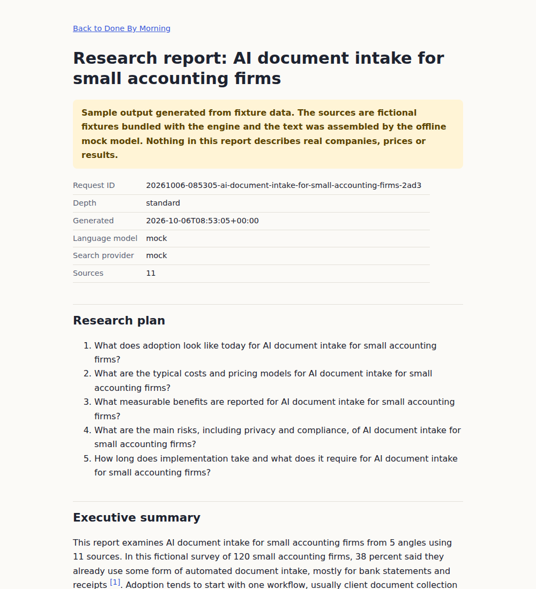

# Done By Morning

Overnight research service: send a business question by 6pm, get a cited report the next morning.

This repo holds both halves of the product:

- **`docs/`**: the landing page (static, served by GitHub Pages) with a working intake form and a
  sample report.
- **`src/done_by_morning/`**: `dbm`, the research engine. It plans sub-questions, gathers sources
  through a pluggable search provider, has an LLM write a report with numbered citations, and
  writes Markdown, HTML and JSON. A file-based queue lets it run as an overnight batch on cron.



| Sample section on the landing page | Sample report (fixture data) |
|---|---|
|  |  |

The committed sample report ([docs/sample/report.html](docs/sample/report.html)) is
**sample output generated from fixture data**: fictional sources and an offline mock model. It
shows the report format, not real research.

## How the engine works

```
question ──> plan ──> gather ──> synthesize ──> validate ──> render
             LLM      search      LLM            citations    md / html / json (/ pdf)
```

1. **Plan** (`agent.py`): the LLM splits the question into N self-contained sub-questions
   (`quick` 3, `standard` 5, `deep` 8).
2. **Gather**: each sub-question goes to the search provider (Tavily, Brave, or the offline
   mock). Results are de-duplicated by URL and numbered. A failed search is logged and skipped
   rather than aborting the run.
3. **Synthesize**: the LLM writes the report using only the numbered sources, citing them as
   `[n]`. The system prompt forbids facts that are not in the sources.
4. **Validate**: any citation number that does not match a gathered source is removed and
   recorded as a pipeline warning. A references list the model may have written is dropped and
   rebuilt from the real source list.
5. **Render** (`render.py`): Markdown, a standalone HTML page with clickable citations, and a
   JSON dump for downstream tooling. PDF is optional through WeasyPrint.

| Module | Role |
|---|---|
| `models.py` | `ResearchRequest`, `Source`, `Report`, depth settings |
| `search.py` | `TavilySearch`, `BraveSearch`, `MockSearch` (keyword scoring over `fixtures/search_fixtures.json`) |
| `llm.py` | `AnthropicLLM` (default, `claude-sonnet-5-5`), `OpenAILLM`, `MockLLM` |
| `providers.py` | Builds providers from CLI flags and environment variables |
| `agent.py` | The pipeline above |
| `queue.py` | Inbox/done/failed/reports folders, lock file, retry-safe batch runs |
| `cli.py` | The `dbm` command |

Anthropic requests use the server-side refusal fallback (`fallbacks: "default"`) by default and
treat `stop_reason: "refusal"` as an error. Set `DBM_ANTHROPIC_FALLBACKS=0` to turn the fallback off.

## Setup

Requires Python 3.10+.

```bash
python -m venv .venv && source .venv/bin/activate
pip install -e ".[dev]"            # engine + pytest + ruff
pip install -e ".[anthropic]"      # for real runs with Claude
# optional: pip install -e ".[openai]"  /  pip install -e ".[pdf]"
```

Try it with no API keys:

```bash
dbm research "AI document intake for small accounting firms" --offline
# writes reports/ai-document-intake-for-small-accounting-firms/report.{md,html,json}
```

Real run:

```bash
cp .env.example .env               # fill in keys, then load it:
set -a; . ./.env; set +a
dbm research "Market for mobile dog grooming in coastal North Carolina" --depth standard
```

## CLI

```bash
dbm research QUESTION [--depth quick|standard|deep] [--context TEXT] [--out DIR]
                      [--llm anthropic|openai|mock] [--search auto|tavily|brave|mock]
                      [--offline] [--pdf] [-q]

dbm queue add QUESTION [--depth ...] [--email ...] [--context ...] [--root queue]
dbm queue add --from-file examples/requests.json [--root queue]
dbm queue status [--root queue]
dbm queue run [--root queue] [--llm ...] [--search ...] [--offline] [--pdf]
```

### Overnight queue

```
queue/
  inbox/      request files waiting (one JSON object or a JSON list per file)
  done/       processed files
  failed/     files with at least one failure, plus <file>.error.txt
  reports/<request-id>/report.md, report.html, report.json, status.json
```

`queue run` takes a lock file so overlapping cron runs cannot collide, keeps going when one
request fails, and skips requests that already have a report, so moving a failed file back into
`inbox/` retries only what is missing. Example crontab entry (runs at 6:30pm local time):

```cron
30 18 * * * cd /path/to/done-by-morning && set -a && . ./.env && set +a && .venv/bin/dbm queue run -q >> queue/cron.log 2>&1
```

## Environment variables

| Variable | Default | Purpose |
|---|---|---|
| `DBM_LLM_PROVIDER` | `anthropic` | `anthropic`, `openai` or `mock` |
| `ANTHROPIC_API_KEY` | | Claude API key (the SDK also accepts an `ant auth login` profile) |
| `DBM_ANTHROPIC_MODEL` | `claude-sonnet-5-5` | Model for planning and synthesis |
| `DBM_ANTHROPIC_FALLBACKS` | `1` | Server-side refusal fallback on/off |
| `OPENAI_API_KEY`, `DBM_OPENAI_MODEL` | `gpt-4.1` | Optional OpenAI provider |
| `DBM_SEARCH_PROVIDER` | `auto` | `auto` picks Tavily, then Brave, by which key is set |
| `TAVILY_API_KEY` / `BRAVE_API_KEY` | | Search API keys |
| `DBM_MOCK_FIXTURES` | bundled file | Alternate fixture JSON for the mock search provider |

## Landing page and intake form

`docs/` is a static site. GitHub Pages serves it from the `docs/` folder of the default branch;
there is no build step. Preview locally with `python -m http.server -d docs 8080`.

The intake form is configured in [`docs/config.js`](docs/config.js):

- **Default (no endpoint):** "Send My Brief" opens the visitor's email app with a prefilled
  message to `hello@businessrunsbetter.com`. Works with no backend.
- **`FORM_FORMAT: "formdata"`:** Formspree or a similar form backend (works from GitHub Pages).
- **`FORM_FORMAT: "brb-contact"`:** the Business Runs Better `contact.php` handler. Sends the
  fields it expects (`name`, `email`, `company`, `interest`, `budget`, `message`, honeypot
  `website`, `started`). `contact.php` must send an `Access-Control-Allow-Origin` header for the
  Pages origin.
- **`FORM_FORMAT: "netlify"`:** Netlify Forms, if the site is moved to Netlify.
- **`INTAKE_URL`:** send visitors to a hosted Tally/Typeform form instead, with answers passed as
  URL parameters.

If a POST fails, the form falls back to the email link. Pricing buttons scroll to the form and
preselect their plan. No payment is taken on the site.

Regenerate the sample report after changing the engine or renderer:

```bash
dbm research "AI document intake for small accounting firms" --offline -q \
  --context "20-person firm deciding whether to adopt before next tax season" \
  --out docs/sample --back-href "../" --back-label "Back to Done By Morning"
```

## Development

```bash
python -m pytest -q        # offline; no test touches the network or a paid API
ruff check . && ruff format --check .
```

CI (`.github/workflows/ci.yml`) runs lint, tests on Python 3.10 and 3.12, an offline smoke run
of `dbm research` and `dbm queue`, and a check that the landing page has no `href="#"` links.

## Status

Working today:

- `dbm research` and `dbm queue` end to end with the mock providers (tested in CI).
- Tavily, Brave, Anthropic and OpenAI providers, unit-tested against mocked HTTP and SDK clients.
  They have not been exercised against live APIs from this repo's CI.
- Landing page with intake form, mailto fallback and sample report.

Not yet implemented:

- Emailing finished reports to clients. `dbm queue run` writes reports to `queue/reports/`;
  delivery is manual for now.
- Payments. Scope and price are confirmed by email.
- Fetching full page text. Synthesis works from search-result excerpts, so a "deep" report is
  broader, not more detailed per source.
- PDF output depends on WeasyPrint and its system libraries; it is optional and untested in CI.

## License

No license file yet; all rights reserved by the author until one is added.
